<p align="center">
  
</p>

# Tópicos

<hr>

# Objetivo

Aprenderemos como implantar nossa aplicação + banco de dados na nuvem, para ele possa ser acessado por outras aplicações.

Além disso, homologaremos a aplicação com banco de dados real, visto que até o presente momento, utilizamos o banco H2. Cabe destacar que precisamos testar as aplicações para ver se ele irá funcionar com o banco real (algumas consultas podem não funcionar).

Para implantar o projeto na nuvem usaremos CI (continuous integration) / CD (continuous delivery) usando PaaS ()

## Requisitos projeto

Todas as premissas e o sumário com o que deve ser feito está no "Documento de Requesitos DSCommerce.pdf".
Como é algo específico do curso, não colocarei o link, mas você pode adquirir no site [devsuperior]().

## Serviços para implantação

Exemplos de serviços "completos" de cloud:

- AWS;
- Azure;
- Google Cloud.

Exemplos de serviços "platform as a service" (PaaS):

Ideal para projetos pequenos.

- Heroku;
- Dokku;
- Netlify;
- OpenShift;
- Firebase.

## Preparando projeto DSList para o estudo de caso com Railway

Aprenderemos o processo de deploy em duas plataformas.

1. No Railway

Utilizaremos o projeto DSList, disponível [aqui](https://github.com/devsuperior/dslist-backend).

Essa plataforma possui uma cota mensal gratuita de minutos.

2. Heroku

Utilizaremos o DSCommerce.

Planos a partir de $10 mensais.

## Perfis de projeto

Quando estamos desenvolvendo um projeto, geralmente configuramos mais de um perfil, os 03 mais clássicos são;

### 1. Perfil de desenvolvimento e testes;

- test
- Banco de dados H2

### 2. Perfil de homologação / staging (rodando o projeto usando ambiente proximo de produção)

- dev
- Banco de dados Postgres de homologação

### 3. Perfil de produção (implatado na nuvem, cliente já usando)

- prod
- Banco de dados Postgres de produção

## Preparando Postgresql e pgAdmin com Docker

Salvar [esse](https://gist.github.com/acenelio/5e40b27cfc40151e36beec1e27c4ff71) script para subir containers Postgres e pgAdmin.

Só clicar em raw e salvar como.

Esse script levanta dois containers que conversarão entre sí.

Um, é o servidor do Postgres e o outro é o pgAdmin, para visualizar os dados de forma gráfica (no navegador).

Só instalar o docker e rodar:

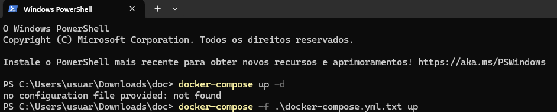

## Perfis de projeto dev e prod

O de teste é simplesmente aquele application-test.properties de sempre usando o banco H2.

Portando, seguiremos o mesmo raciociono para os perfis restantes

### Dev

Criar application-dev.properties e inserir os dados do Postgres **local**:

```.properties
#spring.jpa.properties.jakarta.persistence.schema-generation.create-source=metadata
#spring.jpa.properties.jakarta.persistence.schema-generation.scripts.action=create
#spring.jpa.properties.jakarta.persistence.schema-generation.scripts.create-target=create.sql
#spring.jpa.properties.hibernate.hbm2ddl.delimiter=;

//lembrar da porta 5433 ao invés de 5432
spring.datasource.url=jdbc:postgresql://localhost:5433/dscatalog
spring.datasource.username=postgres
spring.datasource.password=1234567

spring.jpa.database-platform=org.hibernate.dialect.PostgreSQLDialect
spring.jpa.properties.hibernate.jdbc.lob.non_contextual_creation=true
spring.jpa.hibernate.ddl-auto=none
```


### Dev

Criar application-prod.properties e inserir dados do Postgres na **nuvem**:

```.properties
spring.datasource.url=${DB_URL}
spring.datasource.username=${DB_USERNAME}
spring.datasource.password=${DB_PASSWORD}

spring.jpa.database-platform=org.hibernate.dialect.PostgreSQLDialect
spring.jpa.properties.hibernate.jdbc.lob.non_contextual_creation=true
spring.jpa.hibernate.ddl-auto=none
```

### Configurar também system.properties

Na pasta principal criar um system.properties e inserir:

```.properties
java.runtime.version=17
```

## Script SQL com seed banco

Criar um import.sql contendo o que está [aqui](https://github.com/devsuperior/dslist-backend?tab=readme-ov-file#importsql)

Provisioriamente faremos o seguinte!

No application-dev, iremos descomentar a 3 primeiras linhas pra que ele gere um scriptSQL.

E no application.properties rodaremos o perfil em "dev" ao invés de "test".

Assim que rodarmos a aplicação, o programa irá criar na sua pasta um script chamado "create.sql".

Copiaremos o conteudo, na tabela iremos em schemas e depois em query tool pra rodar o script.

Assim que fizermos isso, tudo que inserirmos lá no Postgres, ao consultar no Postman, por exemplo, ele irá conseguir puxar os dados.

❗Não esquecer de mudar o campo de perfil e comentar novamente as linhas.

## Homologação local com Postgresql

Lembra que falamos a necessidade de testar os endpoints pois as querys customizadas poderiam dar um erro?

Esse é um exemplo, nessa query, renomeamos o "tb_game.game_year" como "year" e não funciona no postgres em virtude da crase!

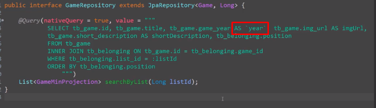

Como arrumar? 

Uma boa ideia seria renomear como "gameYear", por exemplo ao invés de year.

Como foi alterado, na Projection precisamos alterar de "getYear" para "getGameYear".


E no DTO (no construtor de Projection para DTO), alterar o get do year, veja: 

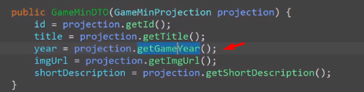

## Deploy no Railway

Requisitos

- Conta no Railway
- Conta no Github com mais de 90 dias
- Projeto Spring Boot salvo no Github
- Script SQL para criação e seed da base de dados
- Aplicativo de gestão de banco instalado (pgAdmin ou DBeaver)

Passos no Railway

1. Prover um servidor de banco de dados

2. Criar a base de dados e seed

3. Criar uma aplicação Railway vinculada


### Primeiro passo
No railway, criar um novo projeto Postgresql onde ele irá criar um ambiente.

Criar no LocalHost uma nova data base com os dados que o Railway irá prover:

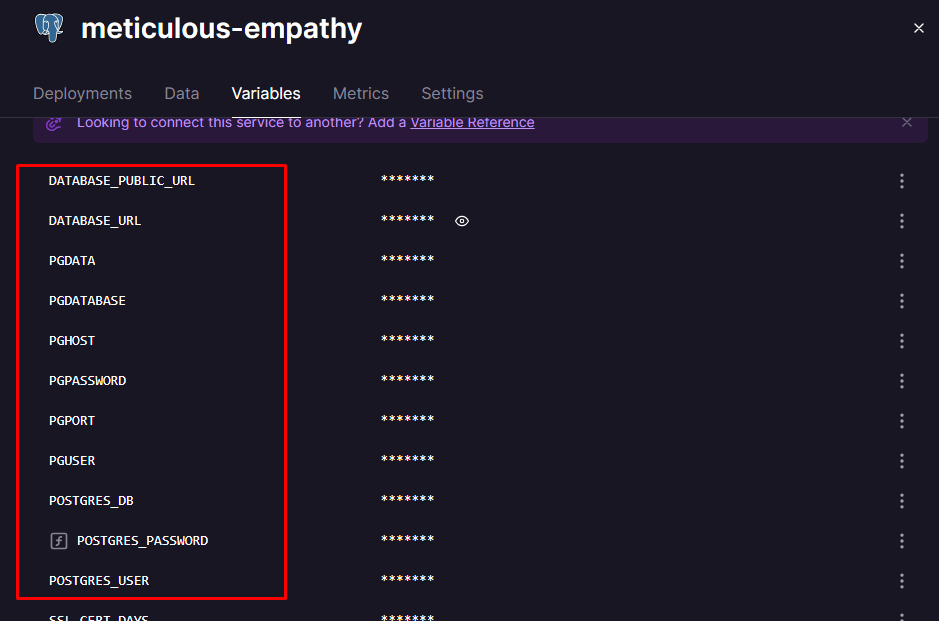

Copiaremos o DATABASE_URL e podemos observar o seguinte (tirar o @ da senha):

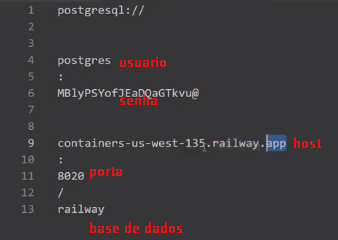

Iremos inserir separadamente no LocalHost:

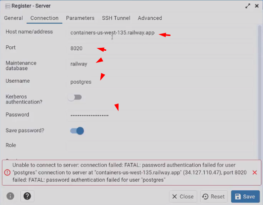

Assim, conectaremos com o banco de dados na nuvem do Railway.

### Segundo passo

Entrar na database criada e ir até public > tables > query tool.

Rodar nosso script de criação do banco de dados.

### Terceiro passo

Vinculando a aplicação Railway com o Github.

Daremos um New project > Deploy from Github repo > Configure Github App.

Escolheremos nosso usuario e iremos logar, selecionaremos embaixo nosso repositorio a ser lido.

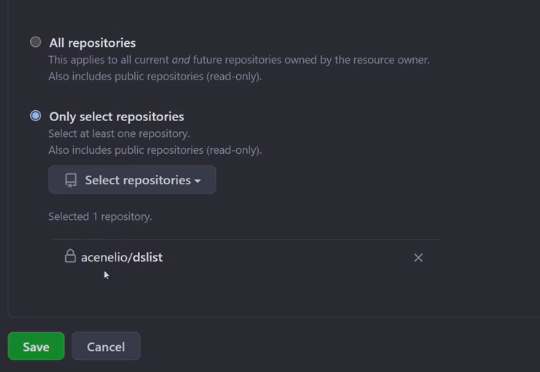

Ele talvez não crie de cara, pois só demos a permissão de leitura. Vá em new project e faça novamente selecionando o projeto.

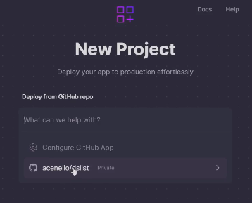

Não dê o deploy, selecionar para adicionar variáveis, inserindo as variáveis do properties de produção.

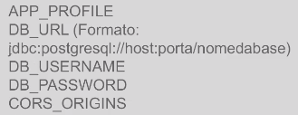

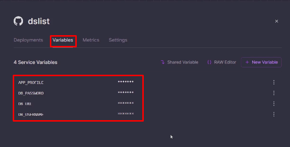

### Quarto passo

Configurando dominio público para a aplicação

No Railway iremos em settings > domains > generate domain.

O bacana agora é, depois de dar esse deploy com o custom domain, nós podemos alterar o LocalHost do Postman para o customizado e fazer as requisições (lembrar que podemos colocar esse URL como uma variável de ambiente).

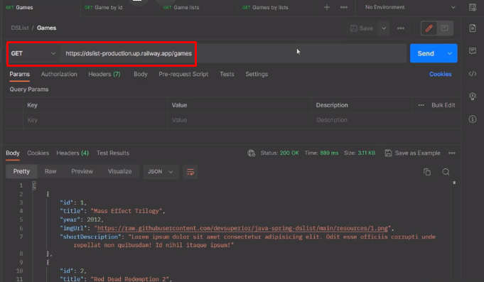

## Teste de CI CD adicionando CORS

Por padrão nosso Backend bloqueia aplicações que não estão autorizadas de acessá-lo, então precisamos configurá-lo para liberar.

Além disso, como o Github está integrado com o Railway, aos fazermos uma alteração na branch Main, automaticamente deve disparar um **novo** deploy.

### Liberando o CORS

Criar uma classe WebConfig no pacote config e iremos inserir o seguinte código:

```java
@Configuration
public class WebConfig {

  //essa variavel está no application.properties
	@Value("${cors.origins}")
	private String corsOrigins;
	
	@Bean
	public WebMvcConfigurer corsConfigurer() {
		return new WebMvcConfigurer() {
			@Override
			public void addCorsMappings(CorsRegistry registry) {
				registry.addMapping("/**").allowedMethods("*").allowedOrigins(corsOrigins);
			}
		};
	}
}
```

Adicionar agora no Railyway a variável CORS_ORIGINS:

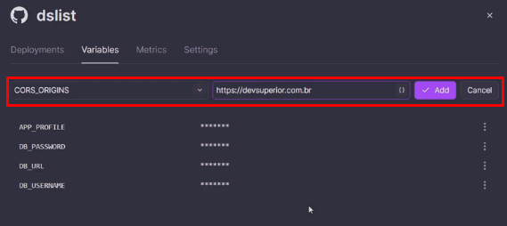

A partir disso, liberaremos o backend para essa URL. Ou seja, no **navegador**, só será acessada por ela, se outro host tentar, tomará um block de CORS.

## Preparando DSCommerce para o estudo de caso com Heroku

1. Uppar o projeto para o Github

2. Adicionar dependencia Postgres Maven

3. Criar o application-dev.properties

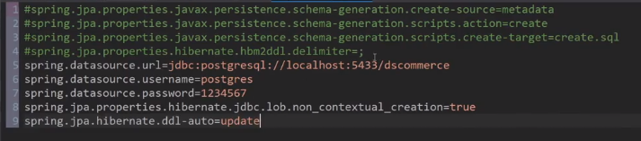

4. Criar no pgAdmin uma database dscommerce

5. Nas tabelas como ela está vazia, rodaremos o projeto para que ele crie o Script SQL.
(lembrar de provisoriamente trocar em application.properties de prod para dev)

6. Lembrar de algumas alterações que devem ser feitas em virtude da alteração de banco H2 pra Postgres?

Nesse caso, ao rodar o projeto ele vai reclamar da falta de equals&hashcode na OrderItemPK.

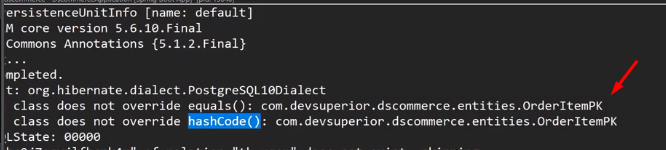

Implementar na PK, Order, Product (comparando pelo ID, como já fizemos previamente).

Ao rodar, no pgAdmin as estruturas de tabelas terão sido criadas.

## Script SQL de criação da base de dados

Conforme dito acima, as tabelas foram criadas, mas os dados não foram importados.

Podemos fazer o seguinte:

1 - Pegaremos nosso import.sql e jogaremos no Query Tool do pgAdmin (de qualquer tabela).

2 - Podemos também gerar o script para uso posterior (usar em uma nuvem, por exemplo)

Descomentar as 4 primeiras linhas (provisoriamente) de codigo do dev.properties:

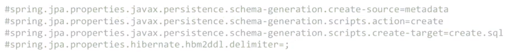

Muda o perfil de test para dev e roda para que o arquivo seja criado.

Esse script tem tudo, inclusive criação de tables (ideal para ambientes remotos).

Para que a gente não queira também expor esse Script no github, podemos excluir o Import/Create.sql ou acrescentar no .gitignore.

## Criando projeto e base de dados no Heroku

CI/CD padrão no Heroku

1. Criar projeto no Heroku, provisionar Postgres e instanciar base de dados


2. Associar projeto local ao Github e ao Heroku

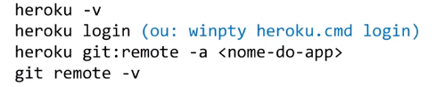


3. Arquivo system.properties


