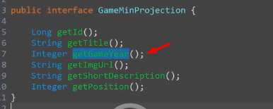

<p align="center">
  
</p>

# Tópicos

<hr>

# Objetivo

Aprenderemos como implantar nossa aplicação + banco de dados na nuvem, para ele possa ser acessado por outras aplicações.

Além disso, homologaremos a aplicação com banco de dados real, visto que até o presente momento, utilizamos o banco H2. Cabe destacar que precisamos testar as aplicações para ver se ele irá funcionar com o banco real (algumas consultas podem não funcionar).

Para implantar o projeto na nuvem usaremos CI (continuous integration) / CD (continuous delivery) usando PaaS ()

## Requisitos projeto

Todas as premissas e o sumário com o que deve ser feito está no "Documento de Requesitos DSCommerce.pdf".
Como é algo específico do curso, não colocarei o link, mas você pode adquirir no site [devsuperior]().

## Serviços para implantação

Exemplos de serviços "completos" de cloud:

- AWS;
- Azure;
- Google Cloud.

Exemplos de serviços "platform as a service" (PaaS):

Ideal para projetos pequenos.

- Heroku;
- Dokku;
- Netlify;
- OpenShift;
- Firebase.

## Preparando projeto DSList para o estudo de caso com Railway

Aprenderemos o processo de deploy em duas plataformas.

1. No Railway

Utilizaremos o projeto DSList, disponível [aqui](https://github.com/devsuperior/dslist-backend).

Essa plataforma possui uma cota mensal gratuita de minutos.

2. Heroku

Utilizaremos o DSCommerce.

Planos a partir de $10 mensais.

## Perfis de projeto

Quando estamos desenvolvendo um projeto, geralmente configuramos mais de um perfil, os 03 mais clássicos são;

### 1. Perfil de desenvolvimento e testes;

- test
- Banco de dados H2

### 2. Perfil de homologação / staging (rodando o projeto usando ambiente proximo de produção)

- dev
- Banco de dados Postgres de homologação

### 3. Perfil de produção (implatado na nuvem, cliente já usando)

- prod
- Banco de dados Postgres de produção

## Preparando Postgresql e pgAdmin com Docker

Salvar [esse](https://gist.github.com/acenelio/5e40b27cfc40151e36beec1e27c4ff71) script para subir containers Postgres e pgAdmin.

Só clicar em raw e salvar como.

Esse script levanta dois containers que conversarão entre sí.

Um, é o servidor do Postgres e o outro é o pgAdmin, para visualizar os dados de forma gráfica (no navegador).

Só instalar o docker e rodar:


## Perfis de projeto dev e prod

O de teste é simplesmente aquele application-test.properties de sempre usando o banco H2.

Portando, seguiremos o mesmo raciociono para os perfis restantes

### Dev

Criar application-dev.properties e inserir os dados do Postgres **local**:

```.properties
#spring.jpa.properties.jakarta.persistence.schema-generation.create-source=metadata
#spring.jpa.properties.jakarta.persistence.schema-generation.scripts.action=create
#spring.jpa.properties.jakarta.persistence.schema-generation.scripts.create-target=create.sql
#spring.jpa.properties.hibernate.hbm2ddl.delimiter=;

//lembrar da porta 5433 ao invés de 5432
spring.datasource.url=jdbc:postgresql://localhost:5433/dscatalog
spring.datasource.username=postgres
spring.datasource.password=1234567

spring.jpa.database-platform=org.hibernate.dialect.PostgreSQLDialect
spring.jpa.properties.hibernate.jdbc.lob.non_contextual_creation=true
spring.jpa.hibernate.ddl-auto=none
```


### Dev

Criar application-prod.properties e inserir dados do Postgres na **nuvem**:

```.properties
spring.datasource.url=${DB_URL}
spring.datasource.username=${DB_USERNAME}
spring.datasource.password=${DB_PASSWORD}

spring.jpa.database-platform=org.hibernate.dialect.PostgreSQLDialect
spring.jpa.properties.hibernate.jdbc.lob.non_contextual_creation=true
spring.jpa.hibernate.ddl-auto=none
```

### Configurar também system.properties

Na pasta principal criar um system.properties e inserir:

```.properties
java.runtime.version=17
```

## Script SQL com seed banco

Criar um import.sql contendo o que está [aqui](https://github.com/devsuperior/dslist-backend?tab=readme-ov-file#importsql)

Provisioriamente faremos o seguinte!

No application-dev, iremos descomentar a 3 primeiras linhas pra que ele gere um scriptSQL.

E no application.properties rodaremos o perfil em "dev" ao invés de "test".

Assim que rodarmos a aplicação, o programa irá criar na sua pasta um script chamado "create.sql".

Copiaremos o conteudo, na tabela iremos em schemas e depois em query tool pra rodar o script.

Assim que fizermos isso, tudo que inserirmos lá no Postgres, ao consultar no Postman, por exemplo, ele irá conseguir puxar os dados.

❗Não esquecer de mudar o campo de perfil e comentar novamente as linhas.

## Homologação local com Postgresql

Lembra que falamos a necessidade de testar os endpoints pois as querys customizadas poderiam dar um erro?

Esse é um exemplo, nessa query, renomeamos o "tb_game.game_year" como "year" e não funciona no postgres em virtude da crase!


Como arrumar? 

Uma boa ideia seria renomear como "gameYear", por exemplo ao invés de year.

Como foi alterado, na Projection precisamos alterar de "getYear" para "getGameYear".



E no DTO (no construtor de Projection para DTO), alterar o get do year, veja: 

